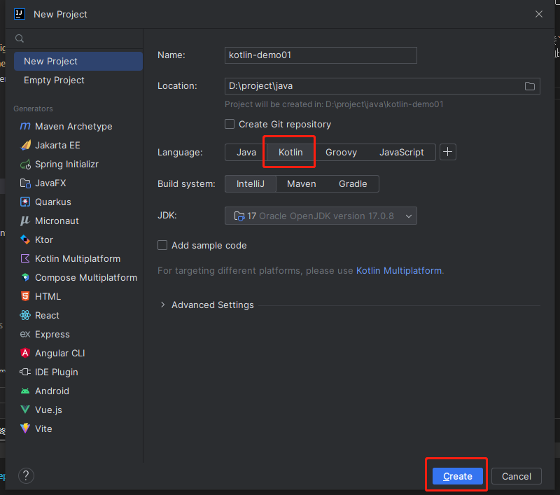

## kotlin 概述

`Kotlin`是由`JetBrains`开发的针对`JVM`用于现代多平台应用的静态编程语言，从`Google`宣布其成为`Android`开发首选语言开始发展迅速，本人对其学习主要就是`Android`开发，其兼容`Java`语法（这点很关键），并且设计更加高效，简洁，注重安全。对于熟悉`Java`的人来说上手十分简单，并且在`Spring`也已经有人尝试用`kotlin`进行开发，虽然`Java`也在变的简洁和高效，但开发者对`Kotlin`的热度依然不低，也没必要去想是否会替代`Java`,时代自会替你做出选择。

该如何学习好呢，学习一门语言最难的就是无从下手，从官网文档开始吧，比如安卓开发，那直接`new Android Project`即可，这时可能会对`Gradle`等等感到陌生，如果没有这些知识，完全可以略过，一开始只需研究`Kotlin`语法，甚至都不要想着能开发出一个`app`,当一开始，就会发现目标开始十分明确，由此衍生出来的知识也逐渐明朗。

## 学习过程

一开始只学习最基本的以及如何使用，如`for`循环有许多扩展方法，但是只学习最基本的循环使用就行，高阶方法应该中应用中学习。

通过`idea`或者`android`创建一个新项目(点击`Add sample code`添加示例代码)：

