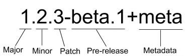

## package.json 解析

### 描述配置

主要是项目的基本信息，包括名称，版本，描述，仓库，作者等，部分会展示在 `npm` 官网上。

#### `name`

主要是项目的基本信息，包括名称，版本，描述，仓库，作者等，部分会展示在 `npm` 官网上。

```json
"name":"vue"
```

#### `version`

```json
"version":"1.1.1"
```



- 1  代表主版本号 Major，通常在涉及重大功能更新，产生了破坏性变更时会更新此版本号

- 2  代表次版本号 Minor，在引入了新功能，但未产生破坏性变更，依然向下兼容时会更新此版本号

- 3  代表修订号 Patch，在修复了一些问题，也未产生破坏性变更时会更新此版本号

還有版本前綴規則

`^`: 只会执行不更改最左边非零数字的更新。 如果写入的是  `^0.13.0`，则当运行  `npm update`  时，可以更新到  `0.13.1、0.13.2`  等，但不能更新到  `0.14.0`  或更高版本。 如果写入的是  `^1.13.0`，则当运行  `npm update`  时，可以更新到  `1.13.1`、`1.14.0`  等，但不能更新到  `2.0.0`  或更高版本。

`~`: 如果写入的是  `〜0.13.0`，则当运行  `npm update`  时，会更新到补丁版本：即  `0.13.1`  可以，但  `0.14.0`  不可以。

`>`: 接受高于指定版本的任何版本。

`>=`: 接受等于或高于指定版本的任何版本。

`<=`: 接受等于或低于指定版本的任何版本。

`<`: 接受低于指定版本的任何版本。

`=`: 接受确切的版本。

`-`: 接受一定范围的版本。例如：`2.1.0 - 2.6.2`。

`||`: 组合集合。例如  `< 2.1 || > 2.6`。

可以合并其中的一些符号，例如  `1.0.0 || >=1.1.0 <1.2.0`，即使用 `1.0.0` 或从 `1.1.0` 开始但低于 `1.2.0` 的版本。
还有其他的规则：

无符号: 仅接受指定的特定版本（例如  `1.2.1`）。
`latest`: 使用可用的最新版本。

#### repository

项目的仓库地址以及版本控制信息。

```json
"repository": {
  "type": "git",
  "url": "https://github.com/xxx/xxx.git",
  "directory": "packages/xxx"
}
```

#### description

项目的描述，会展示在 `npm` 官网，让别人能快速了解该项目。

```json
"description": "React is a JavaScript library for building user interfaces."
```

#### keywords

一组项目的技术关键词，比如 `Ant Design` 组件库的 `keywords` 如下：

```json
"keywords": [
  "ant",
  "component",
  "components",
  "design",
  "framework",
  "frontend",
  "react",
  "react-component",
  "ui"
 ],
```

好的关键词可以帮助别人在 `npm` 官网上更好地检索到此项目，增加曝光率。

#### homepage

项目主页的链接，通常是项目 `github` 链接，项目官网或文档首页。

```json
"homepage": "https://reactjs.org/"
```

#### bugs

项目 `bug` 反馈地址，通常是 `github issue` 页面的链接。

```json
"bugs": "https://github.com/vuejs/core/issues"
```

#### license

项目的开源许可证。项目的版权拥有人可以使用开源许可证来限制源码的使用、复制、修改和再发布等行为。常见的开源许可证有 `BSD、MIT、Apache` 等，它们的区别可以参考：如何选择开源许可证？

```json
"license": "MIT"
```

#### author

项目作者。

```json
"author": "xxx",
```

### 文件配置

包括项目所包含的文件，以及入口等信息。

#### files

项目在进行 `npm` 发布时，可以通过 `files` 指定需要跟随一起发布的内容来控制 `npm` 包的大小，避免安装时间太长。
发布时默认会包括 `package.json`，`license`，`README` 和 `main` 字段里指定的文件。忽略 `node_modules`，`lockfile` 等文件。
在此基础上，我们可以指定更多需要一起发布的内容。可以是单独的文件，整个文件夹，或者使用通配符匹配到的文件。

```json
"files": [
  "filename.js",
  "directory/",
  "glob/*.{js,json}"
 ]
```

一般情况下，`files` 里会指定构建出来的产物以及类型文件，而 `src`，`test` 等目录下的文件不需要跟随发布。

#### tyype

在 `node` 支持 `ES` 模块后，要求 `ES` 模块采用 `.mjs` 后缀文件名。只要遇到 `.mjs` 文件，就认为它是 `ES` 模块。如果不想修改文件后缀，就可以在 `package.json` 文件中，指定 `type` 字段为 `module`。

```json
"type": "module"
```

这样所有 `.js` 后缀的文件，`node` 都会用 `ES` 模块解释。

如果还要使用 `CommonJS` 模块规范，那么需要将 `CommonJS` 脚本的后缀名都改成`.cjs`，不过两种模块规范最好不要混用，会产生异常报错。

#### main

项目发布时，默认会包括 `package.json`，`license`，`README` 和`main` 字段里指定的文件，因为 `main` 字段里指定的是项目的入口文件，在 `browser` 和 `Node`环境中都可以使用。

如果不设置 `main` 字段，那么入口文件就是根目录下的 `index.js`。

比如 `packageA` 的 `main` 字段指定为 `index.js`。

```json
"main": "./index.js"
```

我们引入 `packageA` 时，实际上引入的就是 `node_modules/packageA/index.js`。

这是早期只有 `CommonJS` 模块规范时，指定项目入口的唯一属性。

#### browser

`main` 字段里指定的入口文件在 `browser` 和 `Node` 环境中都可以使用。如果只想在 `web` 端使用，不允许在 `server` 端使用，可以通过 `browser` 字段指定入口。

```json
"browser": "./browser/index.js"
```

#### module

同样，项目也可以指定 `ES` 模块的入口文件，这就是 `module` 字段的作用。

```json
"module": "./index.mjs"
```

当一个项目同时定义了 `main`，`browser` 和 `module`，像 `webpack`，`rollup` 等构建工具会感知这些字段，并会根据环境以及不同的模块规范来进行不同的入口文件查找。

```json
"main": "./index.js",
"browser": "./browser/index.js",
"module": "./index.mjs"
```

比如 `webpack` 构建项目时默认的 `target` 为 `'web'`，也就是 `Web` 构建。它的 `resolve.mainFeilds` 字段默认为 `['browser', 'module', 'main']`。

```js
module.exports = {
  //...
  resolve: {
    mainFields: ["browser", "module", "main"],
  },
};
```

此时会按照 `browser` -> `module` -> `main` 的顺序来查找入口文件。

#### exports

`exports` 字段可以配置不同环境对应的模块入口文件，并且当它存在时，它的优先级最高。(`node>=14`)

比如使用 `require` 和 `import` 字段根据模块规范分别定义入口：

```json
{
"exports": {
  "require": "./index.js",
  "import": "./index.mjs"
 }
}

//等同於
{
  "exports": {
  ".": {
    "require": "./index.js",
    "import": "./index.mjs"
  }
 }
}
```

这样的配置在使用 `import 'xxx'` 和 `require('xxx')` 时会从不同的入口引入文件，`exports` 也支持使用 `browser` 和 `node` 字段定义 `browser` 和 `Node` 环境中的入口。

为什么要加一个层级，把 `require` 和 `import` 放在 "`.`" 下面呢？

因为 `exports` 除了支持配置包的默认导出，还支持配置包的子路径。

比如一些第三方 `UI` 包需要引入对应的样式文件才能正常使用。

`` import `packageA/dist/css/index.css`; ``

我们可以使用 `exports` 来封装文件路径：

```js
"exports": {
  "./style": "./dist/css/index.css'
}
```

使用只需要：

`` import `packageA/style`; ``

除了对导出的文件路径进行封装，`exports` 还限制了使用者不可以访问未在 "`exports`" 中定义的任何其他路径。

#### workspaces

项目的工作区配置，用于在本地的根目录下管理多个子项目。可以自动地在 `npm install` 时将 `workspaces` 下面的包，软链到根目录的 `node_modules` 中，不用手动执行 `npm link` 操作。

`workspaces` 字段接收一个数组，数组里可以是文件夹名称或者通配符。比如：

```json
"workspaces": [
  "workspace-a"
]
```

表示在 `workspace-a` 目录下还有一个项目，它也有自己的 `package.json`。

```js
package.json
workspace-a
  └── package.json
```

### 腳本配置

#### scripts

指定项目的一些内置脚本命令，这些命令可以通过 `npm run` 来执行。通常包含项目开发，构建 等 `CI` 命令，比如：

```json
"scripts": {
  "build": "webpack"
}
```

我们可以使用命令 `npm run build` / `yarn build` 来执行项目构建。

除了指定基础命令，还可以配合 `pre` 和 `post` 完成命令的前置和后续操作，比如：

```json
"scripts": {
  "build": "webpack",
  "prebuild": "xxx", // build 执行之前的钩子
  "postbuild": "xxx" // build 执行之后的钩子
}
```

但是这样的隐式逻辑很可能会造成执行工作流的混乱，所以 `pnpm` 和 `yarn2` 都已经废弃掉了这种 `pre/post` 自动执行的逻辑,[pnpm/issues/2891](https://github.com/pnpm/pnpm/issues/2891)

如果需要手动开启，`pnpm` 项目可以设置 `.npmrc enable-pre-post-scripts=true`。

```sh
enable-pre-post-scripts=true
```

#### config

`config` 用于设置 `scripts` 里的脚本在运行时的参数。比如设置 `port` 为 `3001`：

```json
"config": {
  "port": "3001"
}
```

在执行脚本时，我们可以通过 `npm_package_config_port` 这个变量访问到 `3001`。

```js
console.log(process.env.npm_package_config_port); // 3001
```

### 依賴配置

项目可能会依赖其他包，需要在 `package.json` 里配置这些依赖的信息。

#### dependencies

运行依赖，也就是项目生产环境下需要用到的依赖。比如 `react`，`vue`，状态管理库以及组件库等。

使用 `npm install xxx` 或则 `npm install xxx --save` 时，会被自动插入到该字段中。

```json
"dependencies": {
  "react": "^xx.xx.x",
  "react-dom": "^xx.xx.x"
}
```

#### devDependencies

开发依赖，项目开发环境需要用到而运行时不需要的依赖，用于辅助开发，通常包括项目工程化工具比如 `webpack`，`vite`，`eslint` 等。

使用 `npm install xxx -D` 或者 `npm install xxx --save-dev` 时，会被自动插入到该字段中。

```json
"devDependencies": {
  "webpack": "^5.69.0"
}
```

#### peerDependencies

同伴依赖，一种特殊的依赖，不会被自动安装，通常用于表示与另一个包的依赖与兼容性关系来警示使用者。

比如 `React` 组件库 `Ant Design`，它的 `package.json` 里 `peerDependencies` 为

```json
"peerDependencies": {
  "react": ">=16.9.0",
  "react-dom": ">=16.9.0"
}
```

表示如果你使用 `Ant Design`，那么你的项目也应该安装 `react` 和 `react-dom`，并且版本需要大于等于 `16.9.0`。

#### optionalDependencies

可选依赖，顾名思义，表示依赖是可选的，它不会阻塞主功能的使用，安装或者引入失败也无妨。这类依赖如果安装失败，那么 `npm` 的整个安装过程也是成功的。

比如我们使用 `colors` 这个包来对 `console.log` 打印的信息进行着色来增强和区分提示，但它并不是必需的，所以可以将其加入到 `optionalDependencies`，并且在运行时处理引入失败的逻辑。

使用 `npm install xxx -O` 或者 `npm install xxx --save-optional` 时，依赖会被自动插入到该字段中。

```json
"optionalDependencies": {
  "colors": "^1.4.0"
}
```

#### peerDependenciesMeta

同伴依赖也可以使用 `peerDependenciesMeta` 将其指定为可选的。

```json
"peerDependencies": {
  "colors": "^1.4.0"
},
"peerDependenciesMeta": {
  "colors": {
    "optional": true
   }
 }
```

#### bundleDependencies

打包依赖。它的值是一个数组，在发布包时，bundleDependencies 里面的依赖都会被一起打包。

比如指定 `react` 和 `react-dom` 为打包依赖：

```json
"bundleDependencies": [
  "react",
  "react-dom"
]
```

在执行 `npm pack` 打包生成 `tgz` 压缩包中，将出现 `node_modules` 并包含 `react` 和 `react-dom`。

::: tip 注意
需要注意的是，这个字段数组中的值必须是在 `dependencies`，`devDependencies` 两个里面声明过的依赖才行。
:::

普通依赖通常从 `npm registry` 安装，但当你想用一个不在 `npm registry` 里的包，或者一个被修改过的第三方包时，打包依赖会比普通依赖更好用。

#### overrides

`overrides` 可以重写项目依赖的依赖，及其依赖树下某个依赖的版本号，进行包的替换。

比如某个依赖 `A`，由于一些原因它依赖的包 `foo@1.0.0` 需要替换，我们可以使用 `overrides` 修改 `foo` 的版本号：

```json
"overrides": {
  "foo": "1.1.0-patch"
}
```

当然这样会更改整个依赖树里的 `foo`，我们可以只对 `A` 下的 `foo` 进行版本号重写：

```json
"overrides": {
  "A": {
    "foo": "1.1.0-patch",
  }
}
```

`overrides` 支持任意深度的嵌套。

::: tip 提示
如果在 · 里也想复写依赖版本号，需要使用 `resolution` 字段，而在 `pnpm` 里复写版本号需要使用 `pnpm.overrides` 字段。
:::

### 發佈配置

主要是和项目发布相关的配置。

#### private

如果是私有项目，不希望发布到公共 `npm` 仓库上，可以将 `private` 设为 `true`。

```json
"private": true
```

#### publishConfig

顾名思义，`publishConfig` 就是 `npm` 包发布时使用的配置。

比如在安装依赖时指定了 `registry` 为 `taobao` 镜像源，但发布时希望在公网发布，就可以指定 `publishConfig.registry`。

```json
"publishConfig": {
  "registry": "https://registry.npmjs.org/"
}
```

### 系統配置

和项目关联的系统配置，比如 `node` 版本或操作系统兼容性之类。这些要求只会起到提示警告的作用，即使用户的环境不符合要求，也不影响安装依赖包。

#### engines

一些项目由于兼容性问题会对 `node` 或者包管理器有特定的版本号要求，比如：

```json
"engines": {
  "node": ">=14 <16",
  "pnpm": ">7"
}
```

要求 `node` 版本大于等于 `14` 且小于 `16`，同时 `pnpm` 版本号需要大于 `7`。

#### os

在 `linux` 上能正常运行的项目可能在 `windows` 上会出现异常，使用 `os` 字段可以指定项目对操作系统的兼容性要求。

```json
"os": ["darwin", "linux"]
```

#### cpu

指定项目只能在特定的 CPU 体系上运行。

```json
"cpu": ["x64", "ia32"]
```

#### 第三方配置

一些第三方库或应用在进行某些内部处理时会依赖这些字段，使用它们时需要安装对应的第三方库。

#### types 或者 typings

指定 `TypeScript` 的类型定义的入口文件

```json
"types": "./index.d.ts",
```

#### unpkg

可以让 `npm` 上所有的文件都开启 `CDN` 服务。

比如 `vue package.json` 的 `unpkg` 定义为 `dist/vue.global.js`

```json
"unpkg": "dist/vue.global.js",
```

当我们想通过 `CDN` 的方式使用链接引入 `vue` 时。

访问 [`https://unpkg.com/vue`](https://unpkg.com/vue) 会重定向到 [https://unpkg.com/vue@3.2.47/dist/vue.global.js](https://unpkg.com/vue@3.2.47/dist/vue.global.js) 是 `Vue` 的最新版本。

#### jsdelivr

与 `unpkg` 类似，`vue` 通过如下的配置

```json
"jsdelivr": "dist/vue.global.js",
```

访问 `cdn.jsdelivr.net/npm/vue` 实际上获取到的是 `jsdelivr` 字段里配置的文件地址。

#### browserslist

设置项目的浏览器兼容情况。`babel` 和 `autoprefixer` 等工具会使用该配置对代码进行转换。当然你也可以使用 `.browserslistrc` 单文件配置。

```json
"browserslist": [
  "> 1%",
  "last 2 versions"
]
```

#### sideEffects

显示设置某些模块具有副作用，用于 `webpack` 的 `tree-shaking` 优化。

比如在项目中整体引入 `Ant Design` 组件库的 `css` 文件。

```js
import 'antd/dist/antd.css'; // or 'antd/dist/antd.less'
```

如果 `Ant Design` 的 `package.json` 里不设置 `sideEffects`，那么 `webapck` 构建打包时会认为这段代码只是引入了但并没有使用，可以 `tree-shaking` 剔除掉，最终导致产物缺少样式。

所以 `Ant Design` 在 `package.json` 里设置了如下的 `sideEffects`，来告知 `webpack`，这些文件具有副作用，引入后不能被删除。

```json
"sideEffects": [
  "dist/*",
  "es/**/style/*",
  "lib/**/style/*",
  "*.less"
]
```

#### lint-staged

`lint-staged` 是用于对 `git` 的暂存区的文件进行操作的工具，比如可以在代码提交前执行 `lint` 校验，类型检查，图片优化等操作。

```json
"lint-staged": {
  "src/**/*.{js,jsx,ts,tsx}": [
    "eslint --fix",
    "git add -A"
  ]
}
```

`lint-staged` 通常配合 `husky` 这样的 `git-hooks` 工具一起使用。`git-hooks` 用来定义一个钩子，这些钩子方法会在 `git` 工作流程中比如 `pre-commit`，`commit-msg` 时触发，可以把 `lint-staged` 放到这些钩子方法中。
