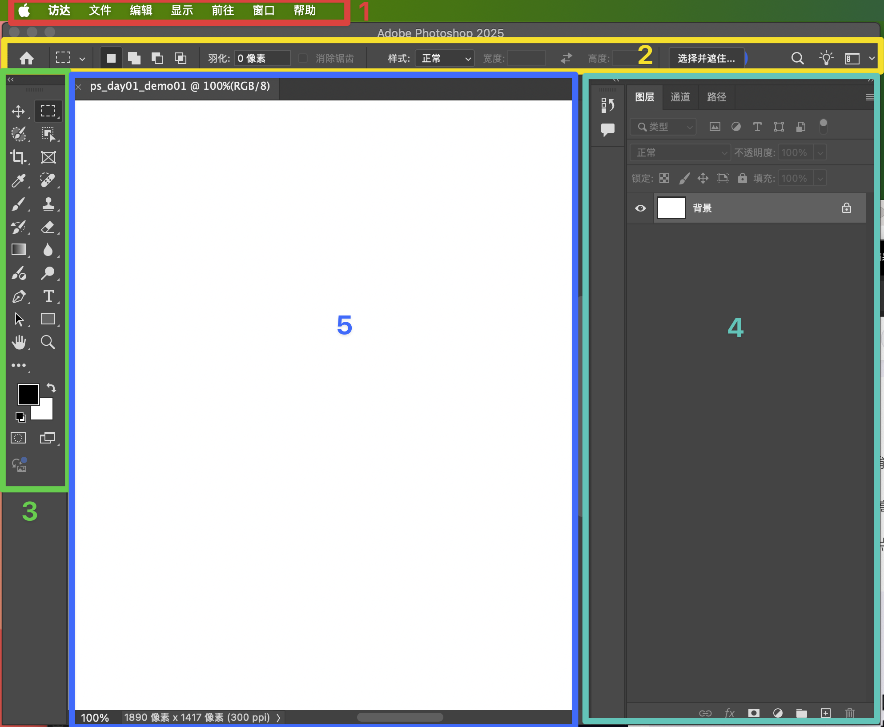
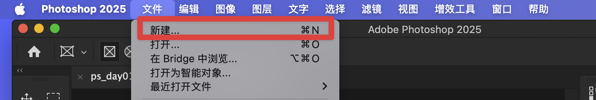
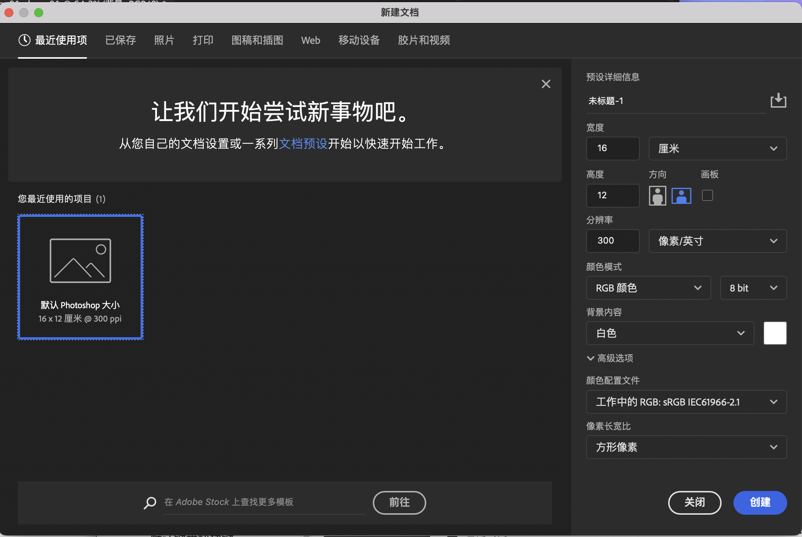

学习前说明：

- 1. 环境：`MacOS 15.3.1(M4芯片)`
- 2. 版本：`Adobe Photoshop 2025(26.2.0)`,安装教程省略（后续有空再补充）。
- 3. 语言：中文
- 4. 多看、多思、多操作

什么是`PS`? `PS`是`Adobe Photoshop`的简称，主要用来处理以像素所构成的位图图像。由美国`Adobe`公司开发和发行。

## 软件界面学习

1. 先打开（双击应用程序icon）即可，然后直接选择新建工作区（也叫项目，或者文档。无所谓，能点进去就行）

2. 操作界面介绍，先看下图：
   

这里解释一下：

- 1. 菜单栏（图中红色部分）：顾名思义就是菜单，几乎包含所有功能以及快捷键
- 2. 属性栏（图中黄色部分）：
- 3. 工具栏（图中绿色部分）：
- 4. 面板堆栈（图中青色色部分）：
- 5. 工作区（图中蓝色部分）：默认有个背景

这里列一些快捷键,看看就行，这些对学习没用，对实际操作有用。

> [!TIP]
> 快捷键较多，不需要记，在使用中遇到场景就会慢慢记住，这里列出是为了知道`PS`支持快捷键这功能,最重要的是快捷键是会变的而且可以改，去背完全浪费时间。

| 功能          | MacOS（快捷键） | Win（快捷键） |
|---------------|:-------------:|------------:|
| 新建文档      |    Cmd + N    |    Ctrl + N |
| 首选项      |    Cmd + K    |    Ctrl + K |

## 新建文档

在菜单栏上点击文件，在展开的菜单中点击新建，如下图：

可以看到右边还有快捷键（`Cmd + N`）,点击即可创建文档。

## 修改文档预设

在新建文档菜单页面中，有很多可以选择的预设选项，我们了解一下就行，不用去记，都是实际使用才会遇到，学习时可以随便选择一个。

### 部分预设类型
1. 最近使用：就是最近使用的文档预设类型。我迷这里第一次打开肯定是没用的，此时会有个默认预设
2. 已保存：包含的是你之前自定义设置并保存下来的文档预设，这里第一次打开肯定也是没用。
3. 打印：例如制作宣传海报、书籍封面、宣传单页、名片等。在这个预设下，常见的分辨率会设置为 `300` 像素 / 英寸，颜色模式多为 `CMYK` 颜色。
4. 照片：对拍摄的数码照片进行后期处理,通常其颜色模式为 `RGB` 颜色，分辨率可能是 `72` 像素 / 英寸（用于屏幕显示）或 `300` 像素 / 英寸（用于打印）。
5. Web：专门为网页设计的文档预设，分辨率为 `72` 像素 / 英寸，颜色模式为 `RGB`
6. 移动设备：包含了多种常见手机屏幕尺寸的预设，方便设计移动应用界面等。
7. 图搞和插图：一般采用 RGB 颜色模式，因为图形和插图很多时候是用于数字媒体展示，如网页、App 界面、社交媒体等，分辨率会根据具体用途有所不同。
8. 胶片和视频：“胶片和视频” 预设是针对与影视制作相关的图像内容设计的。它考虑了视频和胶片在尺寸、分辨率、像素长宽比以及颜色空间等方面的特殊要求。

> 除了默认预设，还可以修改一些详细参数

1. 名称：为文档命名。
2. 宽度和高度：指定文档的大小。从弹出菜单中选择单位。
3. 方向：指定文档的页面方向：横向或纵向。
4. 画板：如果您希望文档中包含画板，请选择此选项。Photoshop 会在创建文档时添加一个画板。
5. 颜色模式：指定文档的颜色模式。通过更改颜色模式，可以将选定的新文档配置文件的默认内容转换为一种新颜色。
6. 分辨率：指定位图图像中细节的精细度，以像素/英寸或像素/厘米为单位。
7. 背景内容：指定文档的背景颜色。

####还有两个高级选项

8. 颜色配置文件：从各种选项中为您的文档指定颜色配置文件。
9. 像素纵横比：指定一帧中单个像素的宽度与高度的比例。

到此我已经学会了如何创建一个`Photoshop`项目。

## 置入文件

现在学习一下如何置入文件，也就是添加素材：

> `在顶部菜单栏` >  `选择文件` > `置入嵌入对象或文件` > `置入链接对象`

置入文件时，可以执行下列任何操作来调整置入图片的位置或变换置入图片：

1. 整置入图片的位置：将指针放在置入图片的定界框内并拖动；
2. 缩放置入图片：拖动定界框的角手柄之一，或者在选项栏中输入 W 和 H 的值。拖动时，按住 Shift 键可以约束比例。
3. 旋转置入图片：请将指针放在定界框外（指针变为弯曲的箭头）并拖动，或为选项栏中的“旋转”选项输入一个值（以度为单位）。图片将围绕置入图片的中心点旋转。
4. 斜切置入图片：按住 `Ctrl` 键 `(Windows)` 或 `Command` 键 `(Mac OS)` 并拖动定界框的边手柄。
5. 置入图片变形: 选取“编辑”>“变换”>“变形”，并从选项栏的“变形样式”弹出式菜单中选取一种变形。
