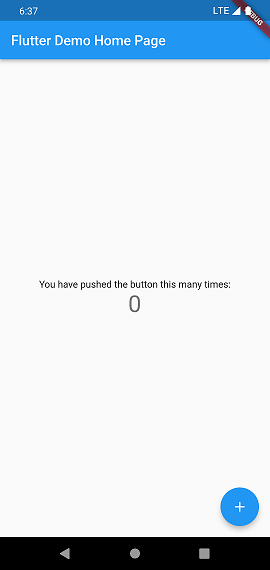

<script setup>
import { coloricon } from "../../../.vitepress/compoment/navbar/coloricon.ts"
coloricon();
</script>

## 创建 Flutter 应用模板

通过 `Android Studio` 或 `VS Code` 创建一个新的 `Flutter` 工程，命名为 "`first_flutter_app`"。创建好后，就会得到一个默认的计数器应用示例。

该计数器示例中，每点击一次右下角带“+”号的悬浮按钮，屏幕中央的数字就会加 1。



主要`Dart`代码是在 `lib/main.dart` 文件中，下面是它的源码：

::: code-group

```dart [带注释]
import 'package:flutter/material.dart';

void main(){
    runApp(const MyApp());
}

class MyApp extends StatelessWidget {
    const MyApp({super.key});
    // This widget is the root of your application.
    //此小部件是根应用程序。
    @override
    Widget build(BuildContext context){
        return MaterialApp(
            title:'Flutter Demo',
            theme:ThemeDate(
         // This is the theme of your application.
        //
        // Try running your application with "flutter run". You'll see the
        // application has a blue toolbar. Then, without quitting the app, try
        // changing the primarySwatch below to Colors.green and then invoke
        // "hot reload" (press "r" in the console where you ran "flutter run",
        // or simply save your changes to "hot reload" in a Flutter IDE).
        // Notice that the counter didn't reset back to zero; the application
        // is not restarted.
        //这是应用程序的主题。
        //尝试使用“flutter run”运行应用程序。你会看到
        //应用程序有一个蓝色工具栏。然后，在不退出应用程序的情况下，尝试
        //将下面的primarySwatch更改为Colors.green，然后调用
        //“热重新加载”（在运行“颤振运行”的控制台中按“r”，
        //或者简单地将更改保存到Flutter IDE中的“热重新加载”）。
        //注意，计数器没有重置回零；应用程序
        //未重新启动。
        primarySwatch: Colors.blue,
            ),
            home:const MyHomePage(title:'Flutter Demo Home Page'),
        );
    }
}

class MyHomePage extends StatefulWidget {
    const MyHomePage({super.key, required this.title});

      // This widget is the home page of your application. It is stateful, meaning
  // that it has a State object (defined below) that contains fields that affect
  // how it looks.

  // This class is the configuration for the state. It holds the values (in this
  // case the title) provided by the parent (in this case the App widget) and
  // used by the build method of the State. Fields in a Widget subclass are
  // always marked "final".
  //此小部件是应用程序的主页。它是有状态的，意思是
  //它有一个State对象（定义如下），该对象包含影响
  //它看起来怎么样。
  //此类是状态的配置。它保存值（在
  //大小写标题）（在本例中为App小部件）和
  //由州的构建方法使用。Widget子类中的字段是
  //始终标记为“"final”。

  final String title;

  @override
  State<MyHomePage> createState()=> _MyHomePageState();
}

class _MyHomePageState extends State<MyHomePage> {
    int _counter = 0;

    void _incrementCounter() {
    setState(() {
      // This call to setState tells the Flutter framework that something has
      // changed in this State, which causes it to rerun the build method below
      // so that the display can reflect the updated values. If we changed
      // _counter without calling setState(), then the build method would not be
      // called again, and so nothing would appear to happen.
      //对setState的调用告诉Flutter框架
      //此状态已更改，这将导致它重新运行下面的生成方法
      //使得显示器可以反映更新的值。如果我们改变了
      //_counter而不调用setState（），则构建方法不会
      //再次呼叫，因此似乎不会发生任何事情。
      _counter++;
    });
    }

    @override
  Widget build(BuildContext context) {
    // This method is rerun every time setState is called, for instance as done
    // by the _incrementCounter method above.
    //
    // The Flutter framework has been optimized to make rerunning build methods
    // fast, so that you can just rebuild anything that needs updating rather
    // than having to individually change instances of widgets.
    //每次调用setState时，都会重新运行此方法，例如done
    //通过上面的_incrementCounter方法。
    //Flutter框架已经过优化，可以重新运行构建方法
    //快速，这样您就可以重建任何需要更新的内容
    //而不必单独更改小部件的实例。
    return Scaffold(
        appBar:AppBar(
        // Here we take the value from the MyHomePage object that was created by
        // the App.build method, and use it to set our appbar title.
        //这里我们从MyHomePage对象中获取值，该对象由
        //App.build方法，并使用它设置appbar标题。
        title: Text(widget.title),
        ),
        body: Center(
        // Center is a layout widget. It takes a single child and positions it
        // in the middle of the parent.
        //中心是一个布局小部件。它需要一个子部件，并将其定位
        //在父母中间。
        child: Column(
            // Column is also a layout widget. It takes a list of children and
          // arranges them vertically. By default, it sizes itself to fit its
          // children horizontally, and tries to be as tall as its parent.
          //
          // Invoke "debug painting" (press "p" in the console, choose the
          // "Toggle Debug Paint" action from the Flutter Inspector in Android
          // Studio, or the "Toggle Debug Paint" command in Visual Studio Code)
          // to see the wireframe for each widget.
          //
          // Column has various properties to control how it sizes itself and
          // how it positions its children. Here we use mainAxisAlignment to
          // center the children vertically; the main axis here is the vertical
          // axis because Columns are vertical (the cross axis would be
          // horizontal).
          //列也是一个布局小部件。它需要一个儿童列表和
         //垂直排列。默认情况下，它调整大小以适应
         //儿童水平，并试图与父母一样高。
         //
         //调用“调试绘画”（在控制台中按“p”，选择
         //Android中Flutter Inspector的“切换调试绘制”操作
         //Studio，或Visual Studio代码中的“切换调试绘制”命令）
         //以查看每个小部件的线框。
         //列具有各种属性来控制其大小和
         //它如何定位自己的孩子。这里我们使用mainAxisAlignment
         //使孩子垂直居中；这里的主轴是垂直的
         //轴，因为列是垂直的（横轴将是水平）。
         mainAxisAlignment: MainAxisAlignment.center,
         children:<Widget>[
            const Text(
              'You have pushed the button this many times:',
            ),
            Text(
              '$_counter',
              style: Theme.of(context).textTheme.headline4,
            ),
         ],
        ),
        ),
        floatingActionButton: FloatingActionButton(
        onPressed: _incrementCounter,
        tooltip: 'Increment',
        child: const Icon(Icons.add),
      ), // This trailing comma makes auto-formatting nicer for build methods.
         //这个尾随的逗号使生成方法的自动格式设置更好。
    )
  }
}
```

```dart [不带注释]
import 'package:flutter/material.dart';

void main() {
  runApp(const MyApp());
}

class MyApp extends StatelessWidget {
  const MyApp({super.key});
  @override
  Widget build(BuildContext context) {
    return MaterialApp(
      title: 'Flutter Demo',
      theme: ThemeData(
        primarySwatch: Colors.blue,
      ),
      home: const MyHomePage(title: 'Flutter Demo Home Page'),
    );
  }
}

class MyHomePage extends StatefulWidget {
  const MyHomePage({super.key, required this.title});

  final String title;

  @override
  State<MyHomePage> createState() => _MyHomePageState();
}

class _MyHomePageState extends State<MyHomePage> {
  int _counter = 0;

  void _incrementCounter() {
    setState(() {
      _counter++;
    });
  }

  @override
  Widget build(BuildContext context) {
    return Scaffold(
      appBar: AppBar(
        title: Text(widget.title),
      ),
      body: Center(
        child: Column(
          mainAxisAlignment: MainAxisAlignment.center,
          children: <Widget>[
            const Text(
              'You have pushed the button this many times:',
            ),
            Text(
              '$_counter',
              style: Theme.of(context).textTheme.headline4,
            ),
          ],
        ),
      ),
      floatingActionButton: FloatingActionButton(
        onPressed: _incrementCounter,
        tooltip: 'Increment',
        child: const Icon(Icons.add),
      ),
    );
  }
}

```

:::

### 模板代码解析

#### 导入包

```dart
import 'package:flutter/material.dart';
```

此行代码作用是导入`Material UI`组件库。[`Material`](https://m3.material.io/)是一种标准的移动端和 web 端的视觉设计语言， `Flutter` 默认提供了一套丰富的 `Material` 风格的 UI 组件。

#### 应用入口

```dart
void main()=>{
    runApp(MyApp());
}
```

- 与`C/C++`、`Java`类似，`Flutter`应用中`main`函数为应用程序的入口。`main`函数中调用了`runApp`方法，作用是启动`Flutter`应用。`runApp`接受一个`Widget`参数，在示例中它是一个`MyApp`对象，`MyApp()`是`Flutter`应用的跟组件。

> 现在只需知道 `runApp`是 `Flutter` 应用的入口即可，后续再学 `Flutter` 应用的启动流程

- `main`同样可以使用箭头（`=>`）函数省略方括号，这是 `Dart` 中单行函数或方法的简写。

#### 应用程序结构

```dart
class MyApp extends StatelessWidget {
  @override
  Widget build(BuildContext context) {
    return MaterialApp(
      //应用名称
      title: 'Flutter Demo',
      theme: ThemeData(
        //蓝色主题
        primarySwatch: Colors.blue,
      ),
      //应用首页路由
      home: MyHomePage(title: 'Flutter Demo Home Page'),
    );
  }
}
```

- `MyApp`类代表`Flutter`应用，它继承了`StatelessWidget`类，这也意味着应用本身也是一个`Widget`。

- 在`Flutter`中，大多数东西都是`widget`（同“组件”或“部件”），包括对齐（`Align`）、填充（`Padding`）、手势处理（`GestureDetector`）等，它们都是以`Widget`的形式提供。

- `Flutter`在构建页面时，会调用`build`方法，`Widget`的主要工作是提供一个`build()`方法来描述如何构建`UI`界面（一般通过组合、拼装其他基础`widget`）。

- `MaterialApp`是`Material`库中提供的`Flutter APP`框架，通过它可以设置应用名称、主题、语言、首页及路由表等。`MaterialApp`也是一个`widget`。

- `home`为`Flutter`应用的首页，他也是一个`widget`。

### 首页

#### 初识`Widget`

```dart
class MyHomePage extends StatefulWidget {
  MyHomePage({Key? key, required this.title}) : super(key: key);
  final String title;

  @override
  _MyHomePageState createState() => _MyHomePageState();
}

class _MyHomePageState extends State<MyHomePage> {
 ...
}
```

`MyHomePage`是应用首页，他继承自`StatefulWidget`类，表示它是一个有状态的组件（`StatefulWidget`）。目前你只要知道有状态的组件（`StatefulWidget`）和无状态的组件（`StatelessWidget`）的概念就行。

- `StatefulWidget`可以拥有状态，这些状态在`Widget`生命周期是可以变的，而且`StatelessWidget`是不可变得。

- `StatelessWidget`至少由两个类组成：
  1. 一个`StatefulWidget`类。
  2. 一个`State`类；`StatefulWidget`类本身是不变的，但是`State`类中持有的状态在`Widget`生命周期中可能会发生变化。

`_MyHomePageState`类是`MyHomePage`类对应的状态类。看到这里时是否已经发现：和`MyApp`类不同，`MyHomePage`类中并没有`build`方法，取而代之的是，`build`方法被挪到了`_MyHomePageState`方法中。这里留个疑问，后续分析为再继续。

#### `State`类

1. `_MyHomePageState`类解析

接下来看看`_MyHomePageState`中包含哪些东西：

- 组件的状态。

由于我们只需要维护一个点击计数器，所以定义一个`_counter`状态：

```dart
int _counter = 0;//用于记录按钮点击的总次数
```

`_counter`为保存屏幕右下角带“+”号按钮点次数的状态。

- 设置状态自增函数

```dart
void _incrementCounter() {
  setState(() {
    _counter++;
  });
}
```

当点击按钮时，会调用此函数，该函数的作用是先自增`_counter`，然后调用`setState`方法。`setState`方法的作用是通知`Flutter`框架，有状态发生改变，`Flutter`框架收到通知后会执行`build`方法来根据新的状态来重新构建界面，`Flutter`对此方法做了优化，使重新执行变得很快，所以你可以重新构建任何需要更新的东西，额无需分别去修改各个`widget`。

- 构建`UI`界面的`build`方法

构建`UI`界面的逻辑在`build`方法中，当`MyHomePage`第一次创建时，`_MyHomePageState`类会被创建，当初始化完成后，`Flutter`框架会调用`widget`的`build`方法来构建`widget`树，最终将`widget`树渲染到设备屏幕上。我们看看`_MyHomePageState`的`build`发中都干了什么事：

```dart
Widget build(BuildContext context) {
  return Scaffold(
    appBar: AppBar(
      title: Text(widget.title),
    ),
    body: Center(
      child: Column(
        mainAxisAlignment: MainAxisAlignment.center,
        children: <Widget>[
          Text('You have pushed the button this many times:'),
          Text(
            '$_counter',
            style: Theme.of(context).textTheme.headline4,
          ),
        ],
      ),
    ),
    floatingActionButton: FloatingActionButton(
      onPressed: _incrementCounter,
      tooltip: 'Increment',
      child: Icon(Icons.add),
    ),
  );
}
```

- `Scaffold`是`Material`库中提供的页面脚手架，它提供了默认的导航栏、标题和包含主屏幕`widget`树（下面同“组件树”或“部件树”）的`body`属性，组件树可以很复杂。

- `body`的树中包含了一个`Center`组件。`Center`可以将其子组件树对齐到屏幕中心。此例中`Center`的子组件是一个`Column`组件，`Column`的作用是将其所以子组件沿屏幕垂直方向依次排列；此例中`Column`子组件是两个 `Text`，第一个`Text` 显示固定文本 `“You have pushed the button this many times:”`，第二个`Text` 显示`_counter`状态的数值。

- `floatingActionButton`是页面右下角带“+”的悬浮按钮，他的`onPressed`属性接受一个回调函数，代表他被点击后的处理器，例子中直接将`_incrementCounter`方法作为其处理函数。

总结，把整个计数器流程串起来：当右下角的`floatingActionButton`被点击后，会调用`_incrementCounter`方法。在`_incrementCounter`方法中，首先 1 会自增`_counter`计数器（状态），然后`setState`会通知`Flutter`框架状态发生改变，接着，`Flutter`框架会调用`build`方法以新的状态重新构建`UI`，最终显示在设备屏幕上。

#### 疑问？

1. 为什么要将 `build` 方法放在 `State` 中，而不是放在`StatefulWidget`中？

回答之前这个问题，这主要是为了提高开发的灵活性。如果将`build()`方法放在`StatefulWidget`中则会有两个问题：

- 状态访问不方便。

试想一下，如果把`StatefulWidget`有很多状态，而每次状态改变都要调用`build`方法，由于状态是保存在`State`中，如果`build`方法在`StatefulWidget`中，那么`build`方法和状态分别在两个类中，那么构建时读取很不方便！如果把`build`方法放在`StatefulWidget`中的话，由于构建用户界面过程中需要依赖`State`，所以`build`方法必须加一个`State`参数，大概如下：

```dart
 Widget build(BuildContext context, State state){
      //state.counter
      //...
  }
```

这样就只能将`State`所有状态声明为公开状态，这样才能在`State`类外部访问状态！但是也会导致状态不再具有私密性，这就导致对状态的修改将变的不可控。但如果见`build()`方法放在`State`中的话，构建过程不仅可以直接访问状态，而且也无需公开私有状态，这会非常方便。

- 继承`StatefulWidget`不方便

例如：`Flutter`中有一个动画`Widget`基类`AnimatedWidget`，它继承自`StatefulWidget`类。`AnimatedWidget`中引入了一个抽象方法`build(BuildContext contetx)`，继续自`AnimatedWidget`的动画`Widget`都要实现这个`build`方法。这时，如果一个`StatefulWidget`类中已经有了一个`build`方法，此时`build`方法需要接收一个`State`对象，这就意味着`AnimatedWidget`必须将自己的`State`对象（记为`_animatedWidgetState`）提供给子类，因为子类需要在其`build`方法中调用父类的`build`方法，代码可能如下：

```dart
class MyAnimationWidget extends AnimatedWidget{
    @override
    Widget build(BuildContext context, State state){
      //由于子类要用到AnimatedWidget的状态对象_animatedWidgetState，
      //所以AnimatedWidget必须通过某种方式将其状态对象_animatedWidgetState
      //暴露给其子类   
      super.build(context, _animatedWidgetState)
    }
}
```

这样明显是不合理的，因为

- `AnimatedWidget`的状态对象是其内部实现细节，不应该暴露给外部。
- 如果将其父类状态暴露给子类，那么必须得有一种传递机制，而做这一套机制是毫无意义的，因为父子类之间状态的传递和子类本身的逻辑是无关的。

综上所述，可以发现，对于`StatefulWidget`，将`build`方法放在 `State` 中，可以给开发带来很大的灵活性。