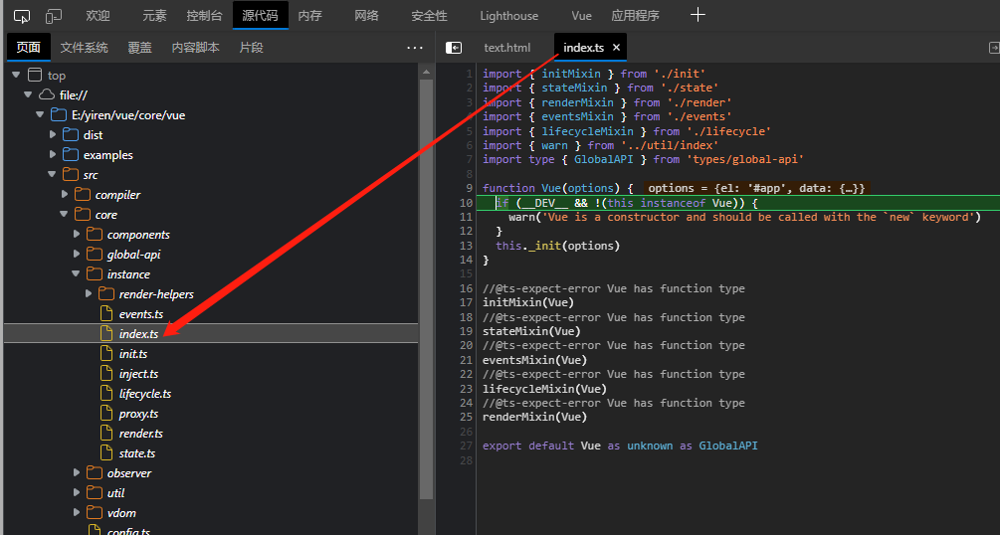

# 🟩 Vue 基础

::: tip Vue 基础知识学习可以看一些公開課
B 站视频：[尚硅谷 Vue2.0+Vue3.0 全套教程丨 vuejs 从入门到精通](https://www.bilibili.com/video/BV1Zy4y1K7SH)
:::

## What is Vue ?

`Vue.js`是一个渐进式 JavaScript 框架，用于构建 UI（用户界面）和 SPA（单页应用程序）。该框架以其快节奏的学习曲线而闻名。它是一个易于学习和平易近人的库，凭借 HTML、CSS 和 JavaScript 的知识，我们可以开始在 Vue.js 中构建 Web 应用程序。快速学习曲线是该框架的一种标志。它是一个多功能框架，可以满足我们作为库或构建大型 Web 应用程序的成熟框架的需求。

## 閱讀 Vue2 源碼

至（`2023-02-13`），目前`Vue3`已經是默認版本，但是工作中也面臨的不同項目使用`Vue2`和`Vue3`交叉的情況，這篇筆記不再是對`Vue2`的學習，而是複習，查漏補缺，閱讀源碼，下面筆記對新人不友好。

## 引入 Vue2 源碼

回顧不再使用`vue_cli`，直接拉取源碼開始邊看邊回顧。即使你用的很熟悉，但是，面試一句：`new Vuw(option)`發生了什麼？

一開始不要深究源碼組成，因為涉及很深，甚至連文件作用都要思考很久，還有很多構建過程，所以一開始不用管，衝如何使用他開始學習，下面我在源碼中使用`Vue`。目的是找到其入口文件。

### 拉取源碼：

```cmd
git clone https://github.com/vuejs/vue.git
```

```cmd
npm i
```

### 開啟--sourcemap

修改 package.json 中的 dev 脚本

```json
"dev": "rollup -w -c scripts/config.js --sourcemap --environment TARGET:full-dev",
```

备注：

- 添加 --sourcemap //用于查看运行时的源代码
- 其中，-c scripts/config.js 指明配置文件
- TARGET:web-full-dev 指明输出文件配置项

### 創建 text.html

在文件中創建測試文件`text.html`（注意：自己要清楚文件位置，比如我是在`examples`下，即測試文件中創建）。

啟動調試：

```cmd
npm run dev
```

```html
<!DOCTYPE html>
<html lang="en">
  <head>
    <meta charset="UTF-8" />
    <meta http-equiv="X-UA-Compatible" content="IE=edge" />
    <meta name="viewport" content="width=device-width, initial-scale=1.0" />
    <title>Vue 初始化过程解析</title>
    <!-- 必須先引入 -->
    <script src="../dist/vue.js"></script>
  </head>
  <body>
    <div id="app">
      <div>{{title}}</div>
    </div>
  </body>
  <script>
    //斷點
    debugger;
    const vm = new Vue({
      el: "#app",
      data: {
        title: "wos",
      },
    });
  </script>
</html>
```

### 查看Vue入口文件



獲取到`vue`入口文件為：`src/core/instance/index.ts`

```ts
import { initMixin } from "./init";
import { stateMixin } from "./state";
import { renderMixin } from "./render";
import { eventsMixin } from "./events";
import { lifecycleMixin } from "./lifecycle";
import { warn } from "../util/index";
import type { GlobalAPI } from "types/global-api";

function Vue(options) {
  if (__DEV__ && !(this instanceof Vue)) {
    warn("Vue is a constructor and should be called with the `new` keyword");
  }
  this._init(options);
}

//@ts-expect-error Vue has function type
initMixin(Vue);
//@ts-expect-error Vue has function type
stateMixin(Vue);
//@ts-expect-error Vue has function type
eventsMixin(Vue);
//@ts-expect-error Vue has function type
lifecycleMixin(Vue);
//@ts-expect-error Vue has function type
renderMixin(Vue);

export default Vue as unknown as GlobalAPI;
```

源碼學習可以這裡開始，遇到不懂的直接在代碼裡面寫注釋就行
