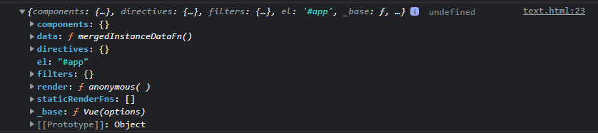

## Vue 构造函数定义

```ts
import { initMixin } from "./init";
import { stateMixin } from "./state";
import { renderMixin } from "./render";
import { eventsMixin } from "./events";
import { lifecycleMixin } from "./lifecycle";
import { warn } from "../util/index";
import type { GlobalAPI } from "types/global-api";
// Vue 构造函数
function Vue(options) {
  if (__DEV__ && !(this instanceof Vue)) {
    warn("Vue is a constructor and should be called with the `new` keyword");
  }
  // 调用 Vue.prototype._init 方法，该方法是在 initMixin 中定义的
  this._init(options);
}
// 定义 Vue.prototype._init 方法
//@ts-expect-error Vue has function type
initMixin(Vue);
//@ts-expect-error Vue has function type
stateMixin(Vue);
//@ts-expect-error Vue has function type
eventsMixin(Vue);
//@ts-expect-error Vue has function type
lifecycleMixin(Vue);
//@ts-expect-error Vue has function type
renderMixin(Vue);

export default Vue as unknown as GlobalAPI;
```

其中`option`就是`new Vue`傳遞的參數，在加入`_init`前還有一部分代碼需要重視：

```ts
//@ts-expect-error Vue has function type
initMixin(Vue);
//@ts-expect-error Vue has function type
stateMixin(Vue);
//@ts-expect-error Vue has function type
eventsMixin(Vue);
//@ts-expect-error Vue has function type
lifecycleMixin(Vue);
//@ts-expect-error Vue has function type
renderMixin(Vue);
```

在`Vue`的构造函数定义之后，有一系列方法会被立即调用。这些方法主要用来给`Vue`函数添加一些原型属性和方法的。其中就有接下来要介绍的`Vue.prototyoe._init`

## Vue.prototype.\_init

在`core/instance/init.js`中我们找到了`_init`的定义

```ts
// 负责 Vue 的初始化过程
Vue.prototype._init = function (options?: Record<string, any>) {
  /**
   * vue 实例 首先缓存当前的上下文到vm变量中，方便之后调用
   */
  const vm: Component = this;
  /**
   * a uid——>每个 vue 实例都有一个 _uid，并且是依次递增的
   */
  vm._uid = uid++;

  /**
   * 重點關注：Performance API,這裡關乎性能
   */
  let startTag, endTag;
  /* istanbul ignore if */
  if (__DEV__ && config.performance && mark) {
    startTag = `vue-perf-start:${vm._uid}`;
    endTag = `vue-perf-end:${vm._uid}`;
    mark(startTag);
  }

  // a flag to mark this as a Vue instance without having to do instanceof
  //将其标记为Vue实例而不必执行instanceof的标志
  /**
   *  avoid instances from being observed避免观察实例
   *  這裡代碼observe在src/core/observer/index.ts裡面<104行>
   *  這裡做簡單介紹：
   * 1. 如果传入值的_isVue为ture时(即传入的值是Vue实例本身)不会新建observer实例(这里可以暂时理解新建observer实例就是让数据响应式)。
   */
  vm._isVue = true;
  /**
   * __v_skip目前是vue3的包裝對象
   */
  vm.__v_skip = true;
  // effect scope
  vm._scope = new EffectScope(true /* detached */);
  vm._scope._vm = true;
  /***
   * 当符合第一个条件是，即当前这个Vue实例是组件。则执行initInternalComponent方法。(该方法主要就是为vm.$options添加一些属性, 后面讲到组件的时候再详细介绍)。当符合第二个条件时，即当前Vue实例不是组件。而是实例化Vue对象时，调用mergeOptions方法。mergeOptions主要调用两个方法，resolveConstructorOptions和mergeOptions。
   *  merge options
    有子组件时，options._isComponent才会为true
   */
  if (options && options._isComponent) {
    /**
     * 每个子组件初始化时走这里，这里只做了一些性能优化
     * 将组件配置对象上的一些深层次属性放到 vm.$options 选项中，以提高代码的执行效率
     */
    // optimize internal component instantiation
    // since dynamic options merging is pretty slow, and none of the
    // internal component options needs special treatment.
    initInternalComponent(vm, options as any);
  } else {
    /**
     * 初始化根组件时走这里，合并 Vue 的全局配置到根组件的局部配置，比如 Vue.component 注册的全局组件会合并到 根实例的 components 选项中
     * 至于每个子组件的选项合并则发生在两个地方：
     *   1、Vue.component 方法注册的全局组件在注册时做了选项合并
     *   2、{ components: { xx } } 方式注册的局部组件在执行编译器生成的 render 函数时做了选项合并，包括根组件中的 components 配置
     */
    // 传入的options和vue自身的options进行合并
    vm.$options = mergeOptions(
      resolveConstructorOptions(vm.constructor as any),
      options || {},
      vm
    );
  }
  // 设置代理，将 vm 实例上的属性代理到 vm._renderProxy
  /* istanbul ignore else */
  if (__DEV__) {
    initProxy(vm);
  } else {
    vm._renderProxy = vm;
  }
  // expose real self
  vm._self = vm;
  // 初始化组件实例关系属性，比如 $parent、$children、$root、$refs 等
  initLifecycle(vm);
  /**
   * 初始化自定义事件，这里需要注意一点，所以我们在 <comp @click="handleClick" /> 上注册的事件，监听者不是父组件，
   * 而是子组件本身，也就是说事件的派发和监听者都是子组件本身，和父组件无关
   */
  initEvents(vm);
  // 解析组件的插槽信息，得到 vm.$slot，处理渲染函数，得到 vm.$createElement 方法，即 h 函数
  initRender(vm);
  // 调用 beforeCreate 钩子函数
  callHook(vm, "beforeCreate", undefined, false /* setContext */);
  // 初始化组件的 inject 配置项，得到 result[key] = val 形式的配置对象，然后对结果数据进行响应式处理，并代理每个 key 到 vm 实例
  initInjections(vm); // resolve injections before data/props
  // 数据响应式的重点，处理 props、methods、data、computed、watch
  initState(vm);
  // 解析组件配置项上的 provide 对象，将其挂载到 vm._provided 属性上
  initProvide(vm); // resolve provide after data/props
  // 调用 created 钩子函数
  callHook(vm, "created");
  // 如果发现配置项上有 el 选项，则自动调用 $mount 方法，也就是说有了 el 选项，就不需要再手动调用 $mount，反之，没有 el 则必须手动调用 $mount
  /* istanbul ignore if */
  if (__DEV__ && config.performance && mark) {
    vm._name = formatComponentName(vm, false);
    mark(endTag);
    measure(`vue ${vm._name} init`, startTag, endTag);
  }

  if (vm.$options.el) {
    // 调用 $mount 方法，进入挂载阶段
    vm.$mount(vm.$options.el);
  }
};
```

## resolveConstructorOptions

上面執行到`if (options && options._isComponent)`時，如果當前`Vue`不是組件，會執行下面`mergeOptions`方法。

`mergeOptions`的功能是合并两个`options`对象,并生成一个新的对象。是实例化和继承中使用的核心方法。先看傳給他的對象，後面再看他乾了什麼，現在研究`resolveConstructorOptions`方法,从字面意思来看，这个方法是来解析`constructor`上的`options`属性的

```ts
vm.$options = mergeOptions(
  resolveConstructorOptions(vm.constructor as any),
  options || {},
  vm
);
```

```ts
export function resolveConstructorOptions(Ctor: typeof Component) {
  let options = Ctor.options;
  // 有super属性，说明Ctor是Vue.extend构建的子类
  if (Ctor.super) {
    const superOptions = resolveConstructorOptions(Ctor.super);
    const cachedSuperOptions = Ctor.superOptions;
    if (superOptions !== cachedSuperOptions) {
      // Vue构造函数上的options,如directives,filters,....
      // super option changed,
      // need to resolve new options.
      Ctor.superOptions = superOptions;
      // check if there are any late-modified/attached options (#4976)
      const modifiedOptions = resolveModifiedOptions(Ctor);
      // update base extend options
      if (modifiedOptions) {
        extend(Ctor.extendOptions, modifiedOptions);
      }
      options = Ctor.options = mergeOptions(superOptions, Ctor.extendOptions);
      if (options.name) {
        options.components[options.name] = Ctor;
      }
    }
  }
  return options;
}
```

这个方法要分成两种情况来说明，第一种是`Ctor`是基础 Vue 构造器的情况，另一种是`Ctor`是通过`Vue.extend`方法扩展的情况。

### Ctor 是基础 Vue 构造器

当`Ctor`(`Ctor`其实就是构造函数)是基础`Vue`构造器时，比如是通过`new`关键字新建`Vue`构造函数的实例

```ts
const vm = new Vue({
  el: "#app",
  data: {
    message: "Hello",
  },
});
```

这个时候`options`就是Vue构造函数上的`options`。如下图



那么这个`options`是在哪里定义的呢？在之前的代码中好像没有看到`options`的定义在哪里？
